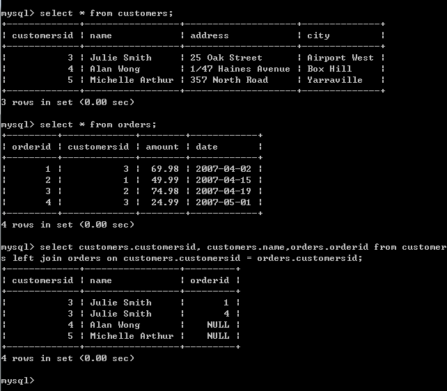
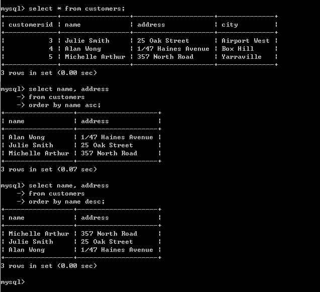
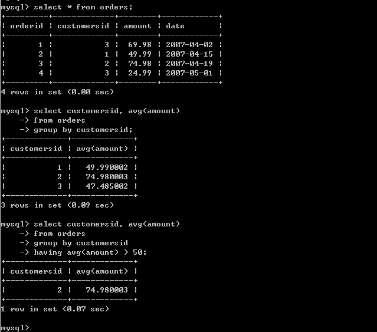
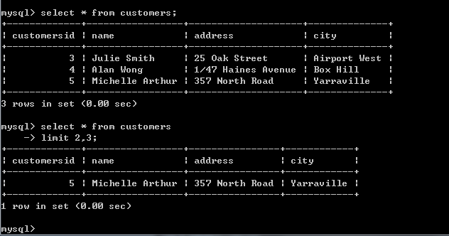

> Note: 以下内容皆为个人读书心得。

### 二、使用 MySQL

#### 8 设计 Web 数据库

##### 8.1 关系数据库的概念

- 键或主键

    唯一标识表中的一条记录。
- 外键

    当某列是其它表中的主键时，该列为外键。
- 模式

    在一个模式中，带有下划线的元素表示该元素是所在关系的主键。斜体元素表示该元素是其所在关系的外键。
- 关系

    关系数据库有 3 种基本的关系类型：一对一，一对多，多对多。
    
##### 8.2 设计 Web 数据库
- 设计原则
    - 避免保存冗余数据
    - 避免多个空属性的设计
- 表格类型的总结
    - 描述现实世界对象的简单表
    - 描述两个现实世界对象的多对多关系的关联表

##### 8.3 Web 数据库架构
    浏览器 <——> Web 服务器 <——> PHP 引擎 <——> MySQL 服务器
    
> 随着应用程序在大小和复杂度上的不断增加，我们可能会将 PHP 应用程序分成不同的层——通常，包括与 MySQL 交互的数据库层、包含了应用程序核心的业务逻辑层和管理 HTML 输出的的表示层。

#### 9 创建 Web 数据库

- 登录 MySQL

    > mysql -h hostname -u username -p

- 创建数据库

    > create database dbname;

- 创建用户

    > grant all on * to rain identified by 'admin' with grant option;

    > revoke all on * from rain;

- 创建数据库表

    > create table tablename(columns)

Note：AUTO_INCREMENT 是一个特殊的 MySQL 特性。它的意思是在表中插入行的时候，如果将该字段设置为空，那么 MySQL 将自动产生一个唯一的标识符值。该值比本列中现存的最大值更大。

#### 10 使用 MySQL 数据库

##### 10.1 增删改查
- 插入数据

    > insert into customers (name, city) values ('Melissa Jones', 'Nar Nar Goon North');

- 获取数据

    > select name, city from customers;

    **1. left join**

    
    
    **2. order by**

    

    **3. group by**

    

    **4. limit**

    > limit 带两个参数： 起始行号与返回行数。行号是以 0 开始索引的。

    

- 更新数据

    > update tablename set column = expression where condition;

- 删除数据

    > delete from tablename;

##### 10.2 其它
- 修改表

    > alter table customers modify name char(70) not null;

- 表的删除

    > drop table tablename;

- 删除整个数据库

    > drop database databasename;
